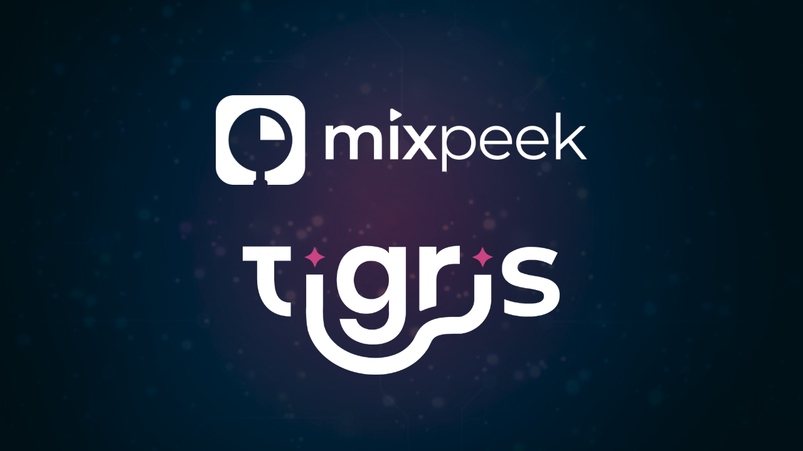
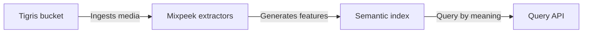
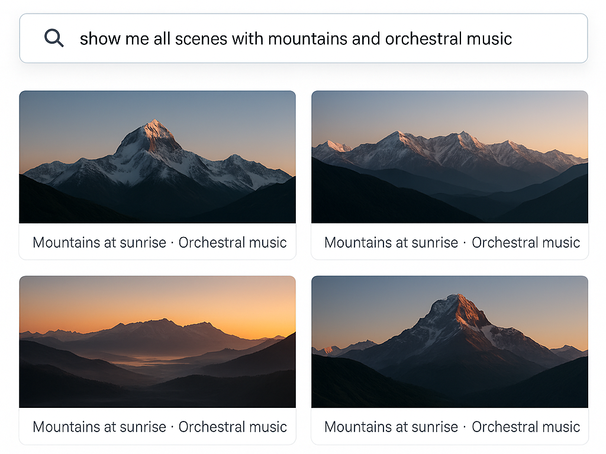
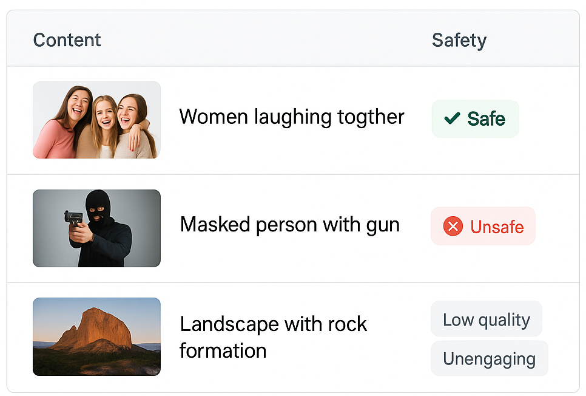
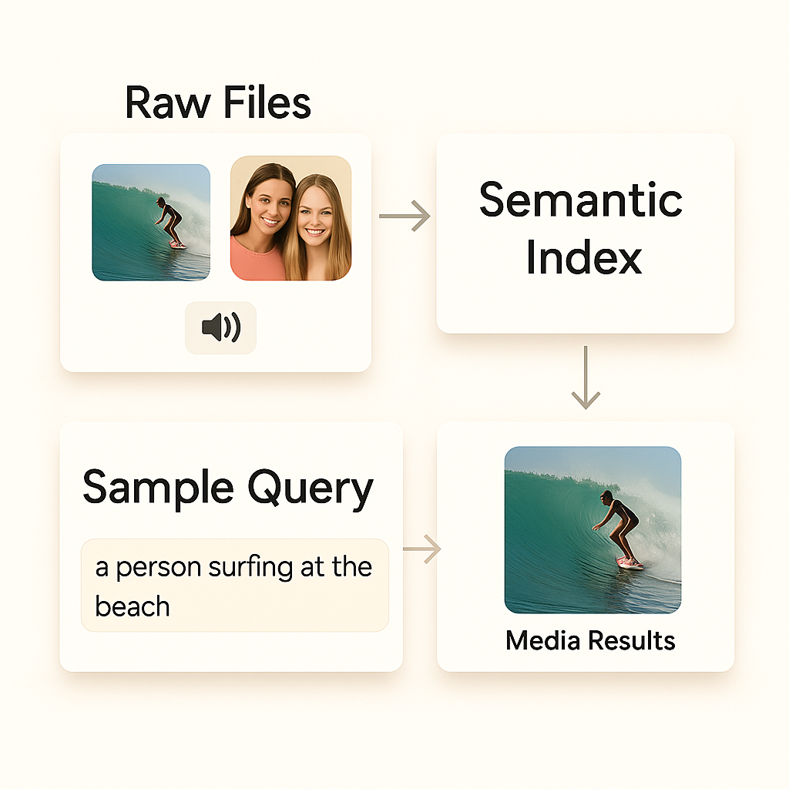
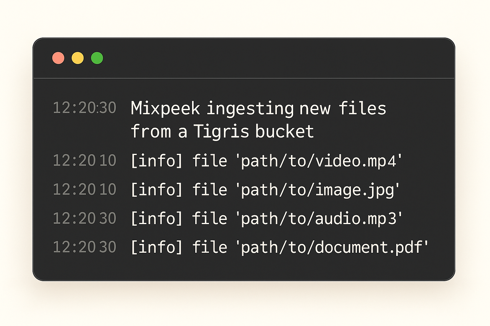

> 🎯 Add AI-powered search to your media files in Tigris. Extract transcripts, detect logos, analyze scenes — all with natural language queries. No ML team needed.

# 🎬 Tigris × Mixpeek  



### Add a Semantic Layer for Media to Your Object Storage

Tigris now integrates natively with **Mixpeek**, giving developers a full **semantic layer for video, image, and audio files** stored in S3-compatible buckets.

Forget manual tagging. Skip the ML team.  
With just a few lines of code, your entire media library becomes **instantly searchable by meaning**.

---

## 🧠 What's a Semantic Layer?

You store raw files. But you need to understand what's in them — who's speaking, what's on screen, what the vibe is.

**Mixpeek** turns your unstructured media into structured, queryable insights:  
transcripts, scene descriptions, logo detection, audio tone, visual embeddings — all extracted and indexed automatically.

It sits on top of your Tigris object storage like a brain:



---

## 🧰 Use Cases: Built for Media & AdTech

### 🎬 Media & Entertainment

**Smart Archives**  
Search entire media libraries using natural language.  
_"Show me all scenes with mountains and orchestral music."_  
Instantly find relevant content without manual tagging or complex queries.

**Audience Intelligence**  
Correlate visual/audio elements with engagement.  
_"Gen Z prefers pastel tones and lo-fi audio in short-form."_  
Make data-driven content decisions based on what actually resonates with viewers.

**Copyright & Brand Compliance**  
Detect reused logos, intros, music clips.  
_"Flagged a remix that included our brand jingle and lower-third graphic."_  
Protect intellectual property and maintain brand consistency at scale.



---

### 🎯 AdTech

**Creative Intelligence**  
Understand why top creatives convert.  
_"High-CTR ads had slow zooms, bright lighting, and female voiceover."_  
Optimize ad creative based on proven performance factors.

**Contextual Targeting**  
Place ads in scenes that visually match brand tone.  
_"Targeted SUV ads to outdoor adventure footage, not just automotive tags."_  
Increase ad relevance and engagement through precise placement.

**Brand Safety**  
Automatically block risky content before ad placement.  
_"Detected violent imagery in a UGC video before we served a family-friendly ad."_  
Protect brand reputation and ensure safe ad environments.



---

## 🔎 How It Works

1. Upload your media files to a Tigris object bucket (S3-compatible)
2. Point Mixpeek at the bucket — it starts ingesting instantly
3. Every video, image, and audio file is run through extractors:
   - 🎞 Scene segmentation
   - 🧠 Visual concept detection
   - 🗣️ Audio transcription + tone analysis
   - 🏷 Logo + object recognition
4. Mixpeek builds a semantic index with embeddings + metadata
5. You query it via a simple API using natural language



---

## ⚙️ Code Example

```python
from mixpeek import Mixpeek

client = Mixpeek("your-api-key")

client.collections.create(
  bucket_url="https://your-tigris-bucket",
  extractors=[
    "video-captioning",
    "image-labeling",
    "audio-transcription",
    "logo-detection"
  ]
)
```

[Read about Feature Extractors](https://mixpeek.com/extractors)

Any time you upload new content to Tigris, Mixpeek automatically processes and indexes it in real time.



---

## 🧑‍💻 Why Developers Love It

* ⚡ Built for S3-compatible object stores (no migration needed)
* 🧠 No ML infra or training required
* 📦 Embeddings, metadata, and labels — out of the box
* 🔍 Unified query layer for all media content
* 🧰 SDKs for Python, JS, and REST

> "It's like adding a search engine and a computer vision team to your media pipeline — instantly."

---

## 📈 Before vs After

| Challenge              | Before                   | With Mixpeek                         |
| ---------------------- | ------------------------ | ------------------------------------ |
| Finding the right clip | Manual tags or filenames | Natural language scene search        |
| Ad placement           | Contextual guesswork     | Scene-level visual/audio matching    |
| IP monitoring          | Manual review            | Automatic brand/music/logo detection |
| Content analytics      | View counts only         | Semantic breakdown of what performs  |

---

## 🧭 Get Started

🔗 [Mixpeek API Docs](https://docs.mixpeek.com)
🔗 [Tigris Object Store](https://www.tigrisdata.com)
📹 [Product Walkthrough (Video)](https://www.youtube.com/watch?v=ZDT7ie2A7A0)
🔗 [Mixpeek / Tigris Integration Docs](https://docs.mixpeek.com/integrations/object-storage/tigris)


---

## 💬 Let's Build

This integration is for devs building:

* Intelligent media platforms
* UGC moderation tools
* Smart video CMS
* Contextual ad engines
* Content search portals

Got a use case? Need help wiring it up?

→ [Talk to a Mixpeek Engineer](https://mixpeek.com/contact)
→ Or email `info@mixpeek.com`

---

Tigris stores the data.
**Mixpeek gives it meaning.**
*This is what infrastructure for AI-native media looks like.*
